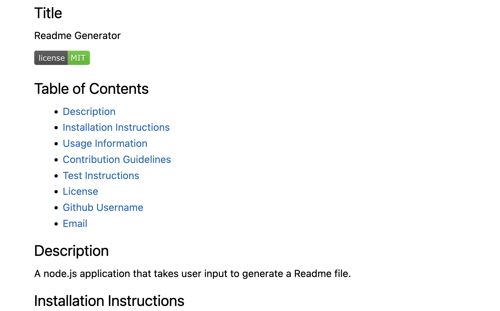

# Readme Generator
This application generates a Readme markdown file based on user inputs.

## Description
This is a node.js application which asks user a set of questions. Based on the answers provided by the user, this application generates a Readme file.

## Installation
`npm init`

## Usage
Run: `node index.js`

Answer all the questions propmted by the application. After answering all the questions a file named `GeneratedReadMe.md` will be generated in the same folder as index.js.

View the markdown file in VSCode preview markdown utility or an online markdown viewer.

## Screen captures
### Video
Walkthrough video can be seen [here](./assets/ReadmeGeneratorWalkThrough.webm)

### Screenshot

## Credits

N/A

## License

Please refer to the LICENSE in the repo.
